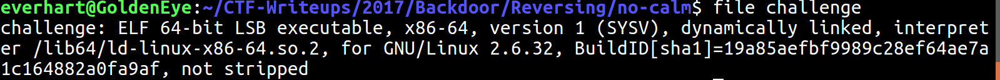

# Backdoor CTF - Rev - no-calm (350 points)
_Author: Brandon Everhart_, _Date: Sept 2017_

## Solve
 
### What are we dealing with?




### Execution: What is the intended use and result? 

Executing the program resulted in the following output:
``` 
    Usage ./challenge <each byte of the flag separated by spaces>
```

According to this, the program is expecting something like the following:
```
    $ ./challenge f l a g { t h i s _ i s _ t h e _ f l a g }
```

Execution of the program in the format specified resulted in the following output:
```
    $ ./challenge f l a g { t h i s _ i s _ t h e _ f l a g }
    Usage ./challenge <each byte of the flag separated by spaces>
```

Not much information gained here, time to look at what the program is doing at a lower level.

### Static Analysis

Load the program into Radare2 and analyze it by using `$ r2 -A program_name`.

*All of the following commands are inside of r2*

List functions using the afl command:


Three functions appear in the list that are probably worth looking at: sym.main, sym.fail__, sym.success__

Seek to the sym.main function by using the command `s function_name`. Then view the control flow graph with the `VV` command.


Above we see that the program is checking for exactly 0x1f (31) arguments passed in on the command line. 


The remainder of the main function was primarily if statements checking that each argument is correct.


Near the end of main there is function call to sym.success__ when all arguments have been verified as correct. 

This appears to be an ideal problem to use the symbolic execution capabilities of angr to help us analyze the binary.

### angr: Symbolic Execution

Check the Python script here: [solve.py](./Files/solve.py)

`FLAG: CTF{Now_th1s_1s_t0_g3t_ANGRyy}`