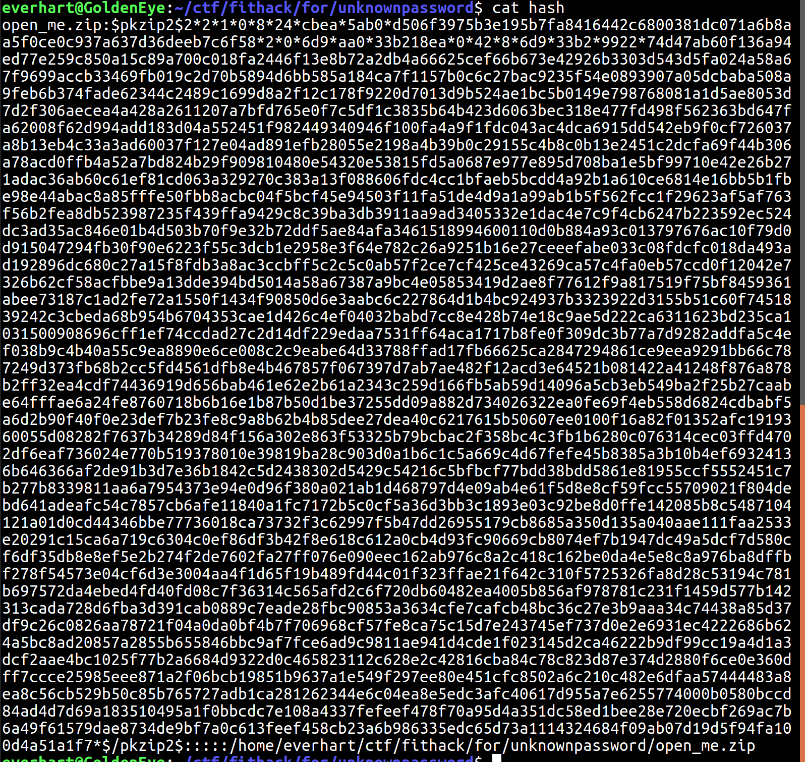

# FIT-HACK - Forensics - Unknown Password (200 points)
_Author: Brandon Everhart_, _Date: Apr 2017_

## Challenge Description

Sorry guys forgot to screen shot and/or write down the description.

## Solve

Well first off, the challenge provided us with a zip file: open_me.zip.
After downloading the zip file the next step was to run the file tool to make sure open_me.zip is in fact a zip file. 

I see here that the file is in fact a zip file so the seemingly logical next step is to try unzipping the open_me.zip file.

Well that didn't work; both of the files in the zip archive are password protected, which makes sense with the name of the challenge being "Unknown password". Even though I couldn't open the files it did show me that there is a file named "flag.png". So crack the password then view the flag? Sounds like a plan. My first attempt at finding the password was to run strings on the file. Nothing helpful there. Time to use John the Ripper. John has a cool feature that handles cracking passwords for zip files, called zip2john.  

Seen above, I ran ./zip2john on the open_me.zip file and saved the output in a file I called "hash" which is seen below.

Now this "hash" file is formatted and ready for john to do some hash/password cracking magic. 

There it is; our password is: pass0123. Now all that is left is to unzip the file and view the flag.png.

`FLAG: FIT{feqDnwJ9YtMrhh0}`