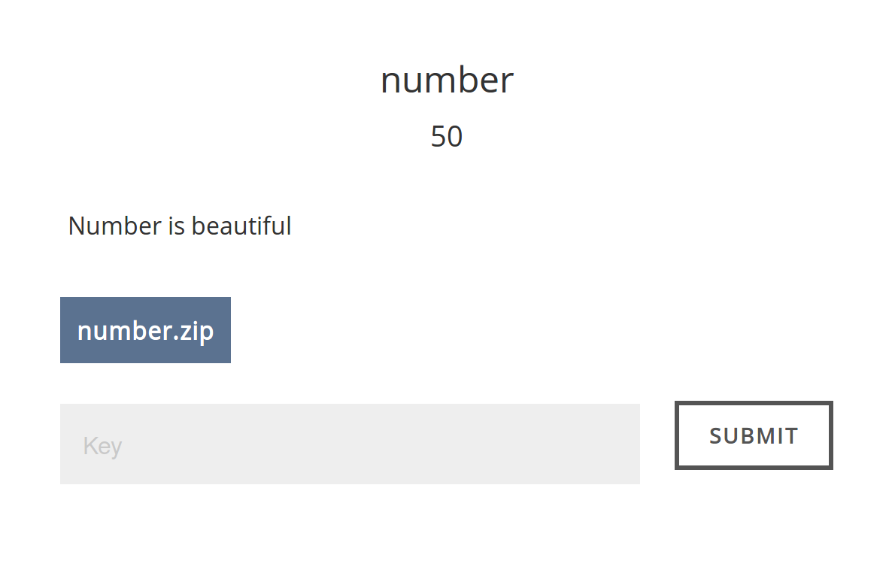
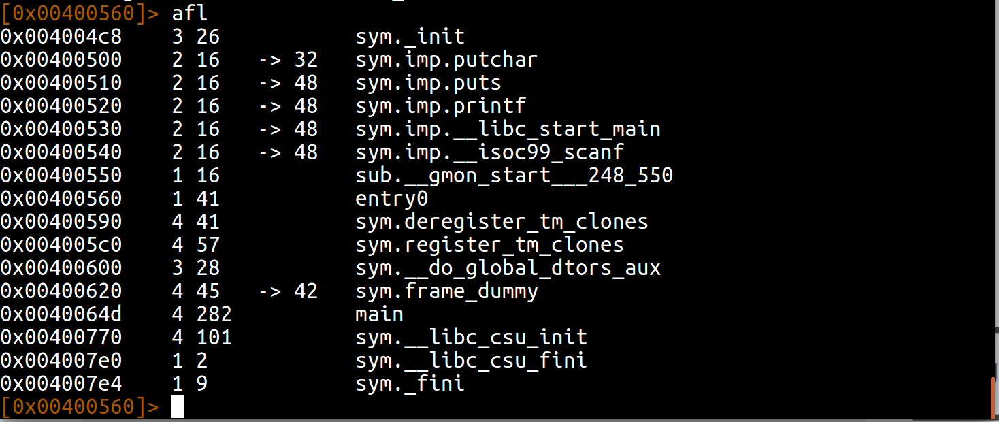
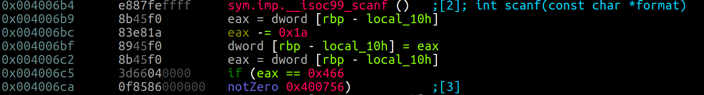
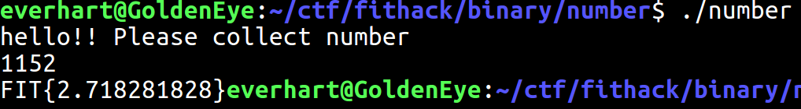

# FIT-HACK - Reversing - Number (50 points)
_Author: Brandon Everhart_, _Date: Apr 2017_

## Solve

First I extract information from the binary using rabin2. I see that it is a non stripped x86 64 bit ELF binary. Next I used rabin2 to look at all of the strings and symbols found in the binary, nothing really helpful found there. Now I opened the binary in radare2 analyzed it and looked at the found functions.  

With the binary not being stripped it was no surprise to see that a main function has been found. In radare2 I seeked to main and started visual mode. While looking at the disassemble I found the user input is compared to a constant value then jumps to either printing the flag or exiting. 

In this section the binary reads the user input into [rbp-local_10h] and moves [rbp-local_10h] into eax. Then it subtracts 0x1a from our value in eax and sets [rbp-local_10h] equal to this new value. Finally this modified user input is compared to 0x466. So we have the equation: `Userinput - 0x1a = 0x466` Using the python interactive terminal I solved this to mean our user input needs to be 1152. I ran the binary and provided this input and got the flag!

`FLAG: FIT{2.718281828}`