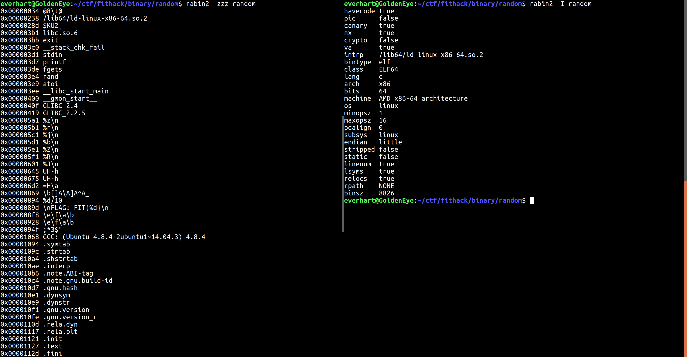
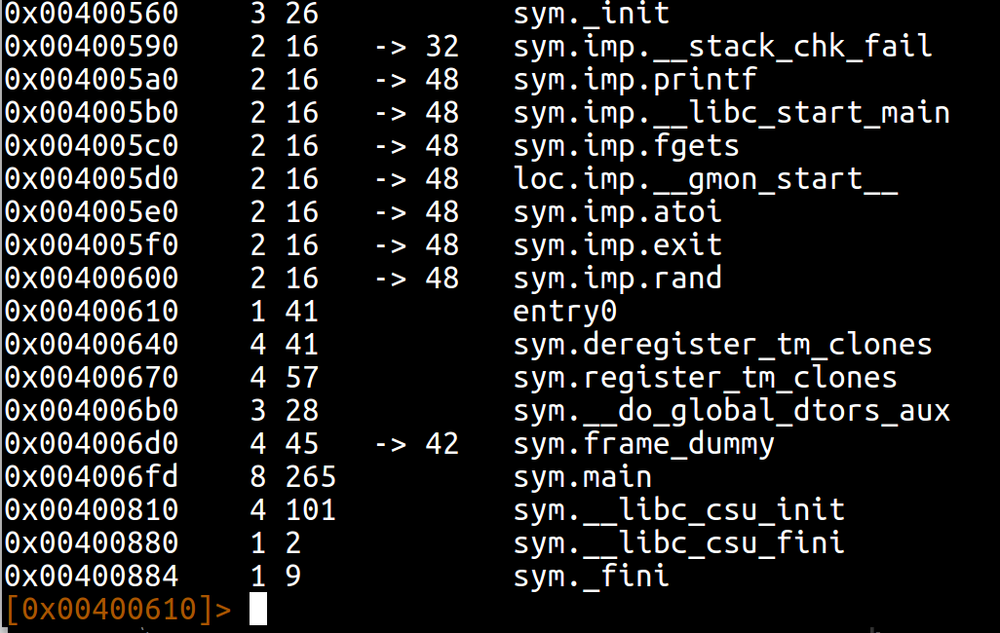
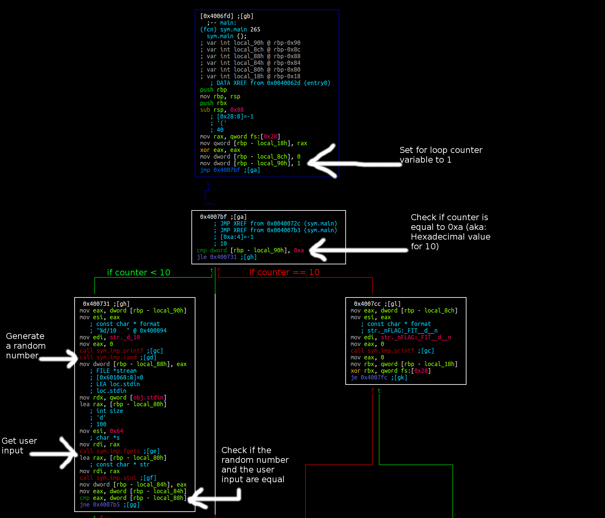
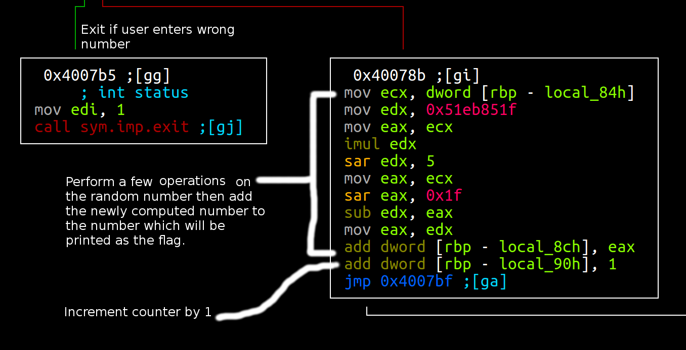
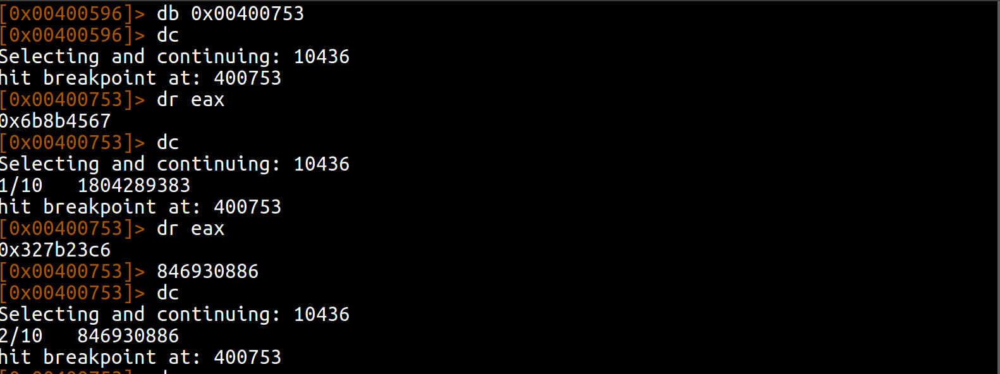

# FIT-HACK - Reversing - Random (100 points)
_Author: Brandon Everhart_, _Date: Apr 2017_

## Solve

I start by extracting information from the binary using rabin2. 

The binary is a non stripped x86 64-bit ELF binary. Looking at the strings and symbols found in the binary, I found the string "\nFLAG: FIT{%d}\n". Now that I know what type of binary it is, I run the binary. 

 

This wasn't much help, I see "1/10" printed to the screen; then when I input anything the program exits. Next I looked for functions in the binary using radare2. 

In radare2 I seeked to sym.main and started visual mode. 

Looking at the disassembly, I find that the binary is running a for loop, and in this for loop a random number is generated then compared to user input. If the user has entered the same value as the random number then the loop will run the next iterations. If the user succeeds at inputting each one of the 10 random numbers then the flag is printed to the screen. If the flag is printed to the screen maybe it is in the file? The next sections show where the flag is coming from.

It appears that the flag is being derived from the random numbers returned from the call to sym.imp.rand(), but if this was true the flag would be just as random as the numbers. Taking a second look at the call to and use of the random function I notice that no seed is being passed to the function. Therefore, random is actually pseudo random in that it returns the same set of numbers each time the binary is ran. So to solve this challenge the user must figure out and enter the 10 random numbers. To do this I set a break point after the random number is generated, then look at the value in the eax register. The value in eax is a hexadecimal number so I used python to get the integer value to input. This is shown bellow:

After inputting each one of the 10 random numbers the binary printed out the flag!

`FLAG: FIT{125853394}`