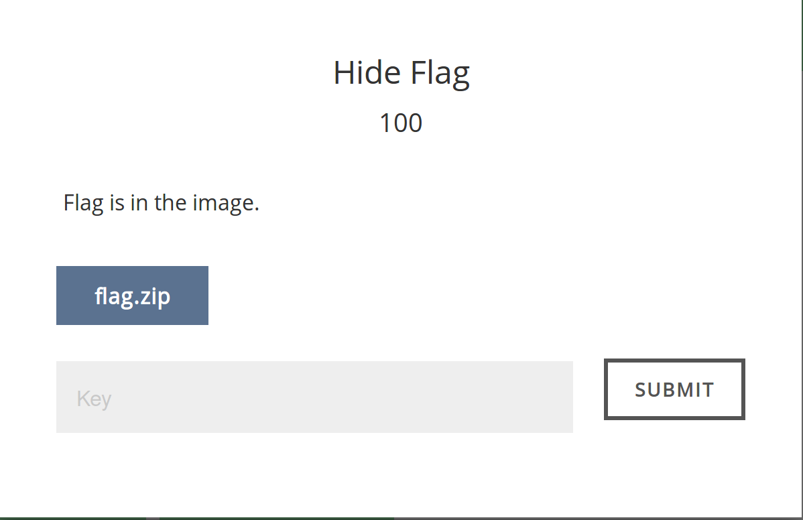
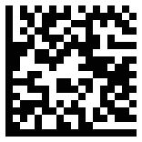
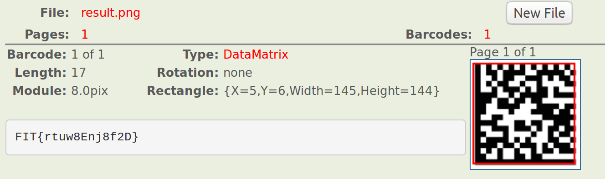

# FIT-HACK - Stego - Hide Falg (100 points)
_Author: Brandon Everhart_, _Date: Apr 2017_

## Provided Image

## Solve

Right off the bat I see that the image appears to be blank. Gathering information about the image using tools such as file, strings, pnginfo, pngcheck and exiftool I find that the image is a PNG image file and has correct formatting. I also find that it is an RGBA image, the A meaning that the alpha channel is present, telling me that the image might be blank because it is transparent. After gathering info about the file my first
step of altering the image is simply to open gimp and play with the color curves. 

Now we see the image appears to be a QR-code, but not exactly correctly formated as a QR-code. After some google searching I learned that this type of barcode is known as DATAMATRIX CODE. Next I found an online tool to read such bar codes at https://online-barcode-reader.inliteresearch.com/. 

`FLAG: FIT{rtuw8Enj8f2D}`
