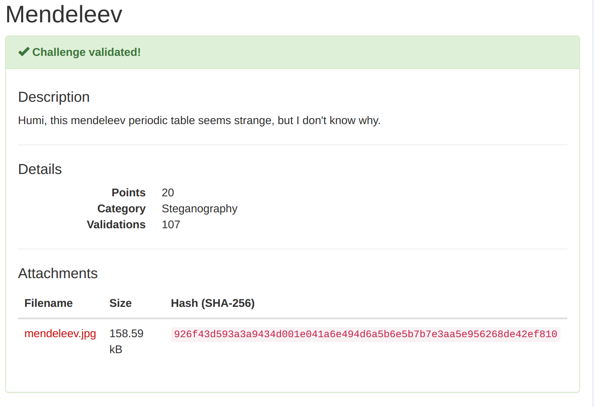
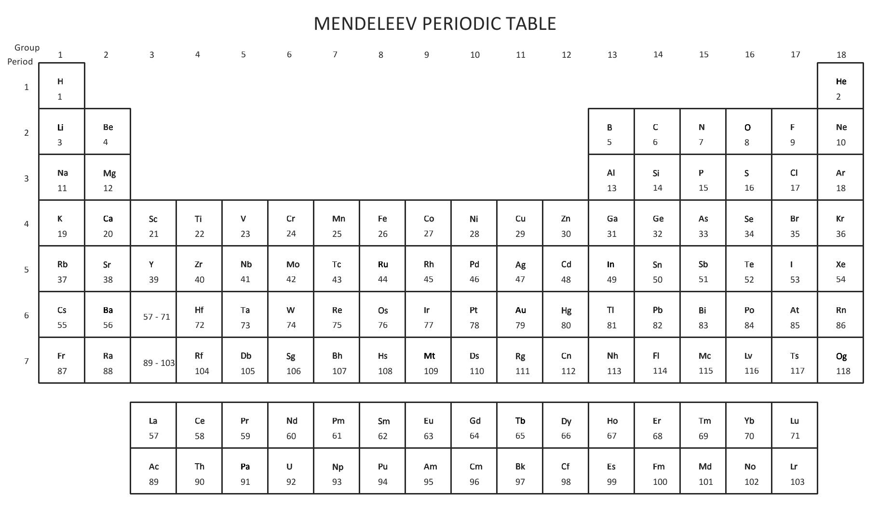
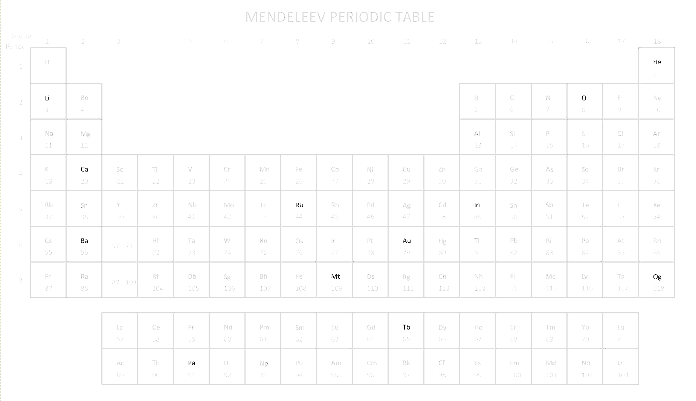

# Nuit Du Hack - Stego - Mendeleev (20 points)
_Author: Brandon Everhart_ ,  _Date: Mar 2017_

## Provided Image

## Solve

Starting this challenge I looked at the provided file using file, strings, and exiftool. These tools provided no information other than further confirming the provided image was in fact a JPEG image file. One of the first things I like to try when dealing with stego or image forensics is to adjust different image properties; I use gimp for this. After adjusting the value curve for the image I noticed just a handful of the elements remained visible when manipulated.  

Placing the elements that remain bolded in order by their atomic number I got:
**HeLiOCaRuInBaTbAuPaMtOg**. Typing this into the challenge confirmed this to be the flag.

