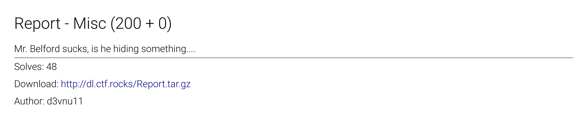

# SEC-T CTF - MISC - Report (200 points)
_Author: Brandon Everhart_, _Date: Sept 2017_



## Solve

### Tools

|Name           | Functionality                             |
|---------------|-------------------------------------------|
|binwalk        |Look for and extract hidden files/data     |
|exiftool       |View file meta-data                        |
|file           |Check file type                            |
|hexdump        |View hex representation along with ASCII   |
|pdf-parser.py  |Parse the PDF into its objects and sections|
|pdfid.py       |View specific PDF object/meta-data         |
|pdfinfo        |View specific PDF meta-data                |
|pdftotext      |Collect all text found in a PDF document   |
|python         |Run *.py tools.                            |
|strings        |Collect all the strings found in the file. |
|Sublime Text   |Text Editor                                |
|tar            |Uncompress data                            |
 
### Step 1: Initial Analysis

Using the tools listed above, look for any information out of the ordinary that makes the provided PDF document different from normal PDF documents. An easy way to do this if you are not an expert on PDF standards is to run the same tools on a plain PDF and compare the results with the challenge PDF results. During this analysis, primarily look for hidden data/information in areas such as meta-data, embedded files, file attachments, trailing/leading data, etc... 

I was unable to locate any hidden information but multiple of the tools returned the same result: "Invalid xref table". 

### Step 2: Xref Table Analysis

The xref table is a predefined table of references to all the objects found in the PDF document. The table is found at the bottom of the file between the line "xref" and "trailer". This is the most common situation but there are exceptions, such as cases where multiple xref tables can exist for a single PDF document. The xref table for the provided PDF looks as follows: 
```
xref
0 146
0000000000 65535 f 
0000013999 00000 n 
0000000019 00000 n 
0000001039 00000 n 
0000022799 00000 n 
...
... +100 more lines
...
0000022389 00043 n 
0000022528 00045 n 
0000022660 00000 n 
0000023428 00000 n 
0000023827 00053 n 
0000023998 00000 n
trailer
```

The first line in the xref table above is "0 146". The first number, 0, is the object ID of the first object referenced by the table. The second number, 146 in this case, is the number of entries in the table. Each of the remaining entries in the table are made up as such: 
```
    decimal-byte-offset-to-object   object-generation-number    f or n
```

Next I wrote a python script to try and see what is wrong with the xref table. The script checked the following:
1. Each entry is exactly 20 bytes including the newline character.
2. The number of entries in the table matches the first line of the table.
3. Each entry points to a valid object at that offset and the generation numbers match.

The script found that some of the generation numbers didn't match. Looking further, all the objects in the document had generation numbers of 0 but our table had hex values for multiple of the generation numbers. 

### Step 3: Flag

Pulling out the invalid generation numbers and converting them to ascii and reading them in reverse revealed:

SECT{N07_N1C3_T0_BR3AK_LUCY}


