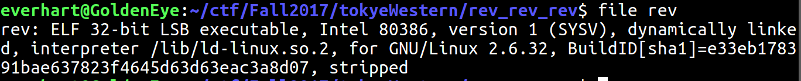
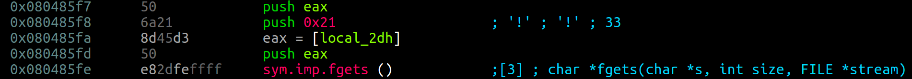

# Tokyo Westerns CTF - Rev - Rev_rev_rev (25 points)
_Author: Brandon Everhart_, _Date: Sept 2017_

## Solve
 
### Step 1: Basic Info

Begin by collecting basic information about the file. Use the _file_ tool to check file type among other things. (While _file_ can return incorrect information it is a better resource than file extensions themselves.)

The results of the file command show the file is a 32-bit binary, ELF file, and is stripped. ELF stands for "Executable and Linkable Format" and is a Linux executable file. The file being stripped means the symbols have been removed from the binary. 

The second tool to gather basic information about the binary is _strings_. This tool can find "strings" that are in the binary (Parameters for what a "string" is can be provided by the user). Output from running the strings tool revealed a possible call to fgets and the strings "Invalid!" and "Correct!".

### Step 2: Execute the File

Check the permissions of the file and if necessary change the permissions to allow execution of the file. Execute the file.

Upon executing the file you can now start to understand what the file is doing and what exactly the challenge is. The challenge is enter the correct string and have the program return "Correct!". This correct string is most likely the flag.  

### Step 3: Disassembly and angr

Disassembly tool: Radare2

Use the Radare2 command afl to list all the functions found in the binary. afl shows us that there is a main function. That is a good place to start looking by using the Radare2 seek command: `$ s main`.

Inside of main you find a call to fgets (shown below). When fgets is called in this case it will pop 3 values off that stack as parameters passed to the function. The second of these parameters being the number of bytes fgets will read from stdin. Looking above the call to fgets the second push instruction is pushing the value 0x21. This means fgets will read 33 bytes. AKA: The flag is no more 32 characters and a newline. 

There are at least two ways to approach this problem now:

1. Continue to analyze the binary and figure out how the input is mutated and what is it compared to.

Or...

2. Use a symbolic execution tool to find an input that returns the desired result.

Here the problem is solved using the symbolic execution tool angr.

The length of the user input is already known but now we need to find the "desired result" for angr to use. In this case the "desired result" is the input that causes the program to reach a certain address. That address, is the address where the program prints "Correct!". 

The angr script can be found at Files/angr_rev.py

The result of running the script is seen below.

`FLAG: TWCTF{qpzisyDnbmboz76oglxpzYdk}`