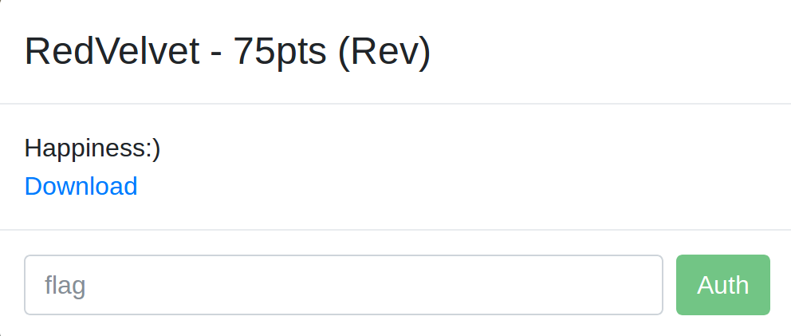
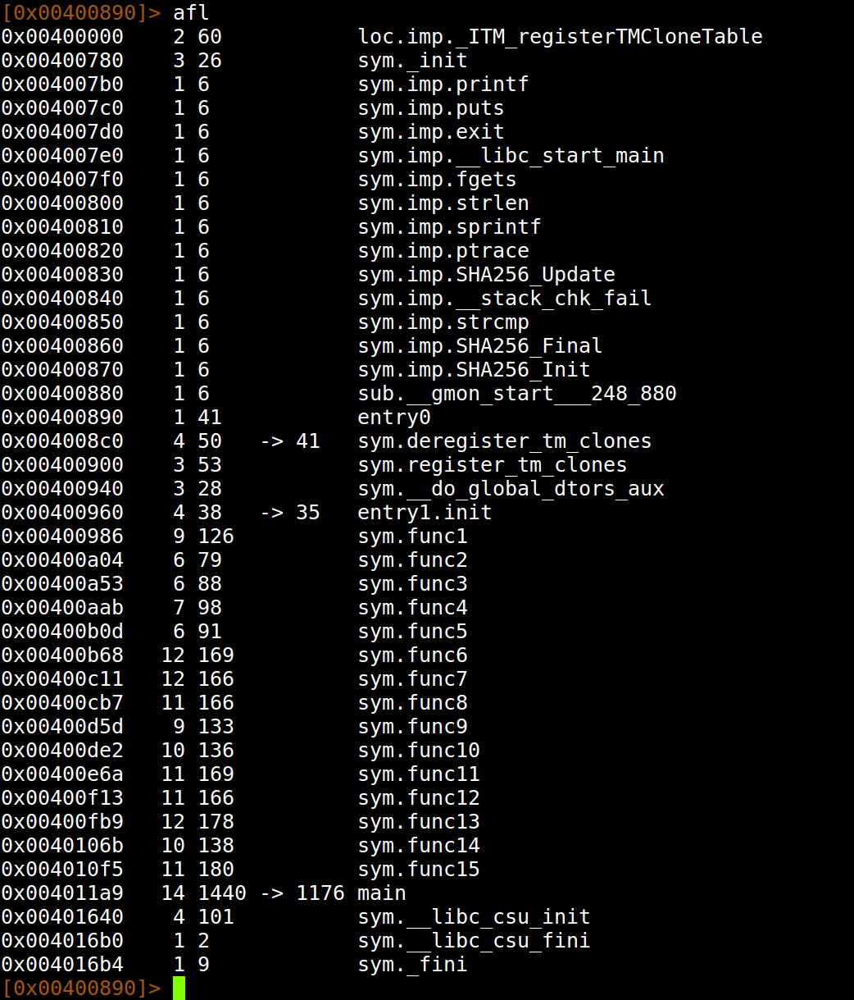
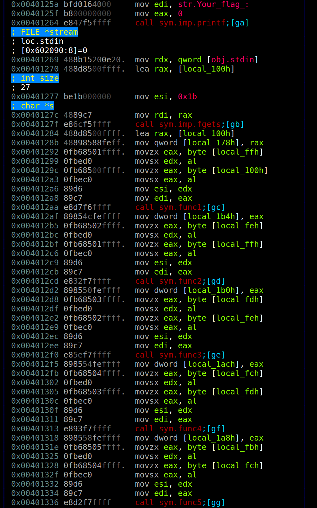
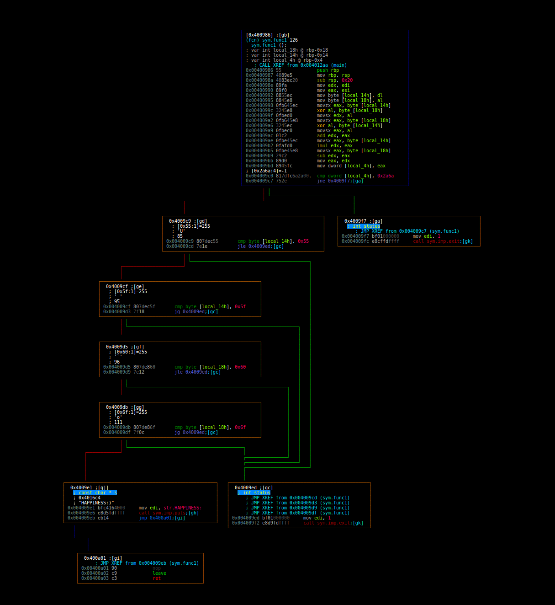
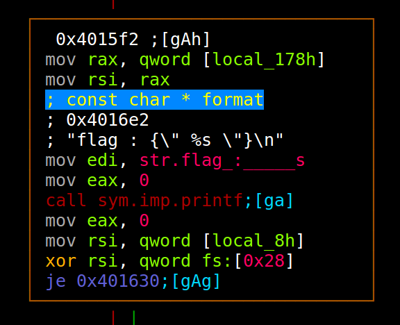
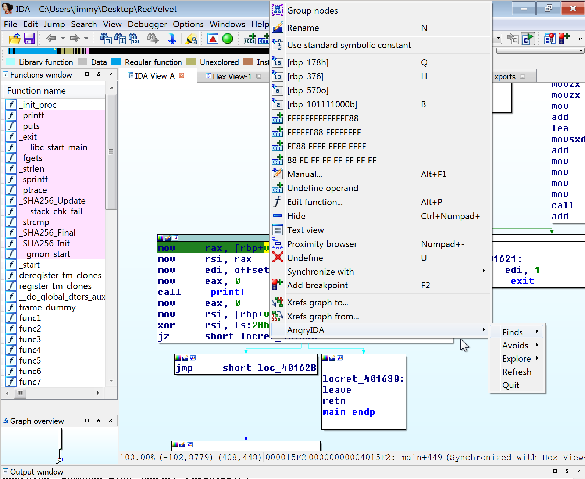
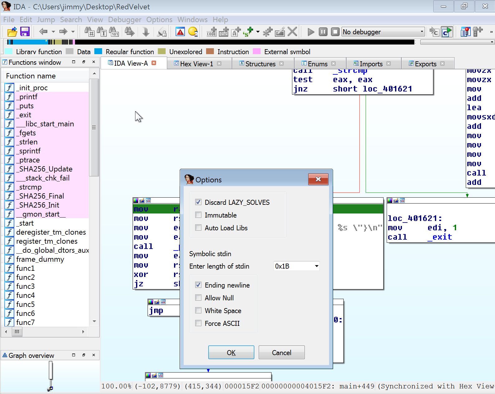
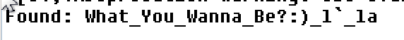
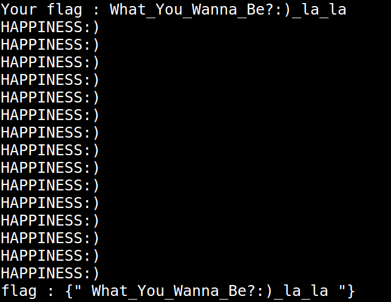

# Codegate - Reversing - RedVelvet (75 points)
_Author: Brandon Everhart_, _Date: Jan 2018_

## tl;dr

File -> Strings -> Radare2 -> AngryIDA (IDA Pro angr plugin) -> Flag.

## Challenge

The challenge provided me with just a download link to a zip file and a comment "Happiness:)". The downloaded file has been renamed and can be found in this directory as RedVelvet.zip. Using the Linux 'file' utility, I identify the file as an: ELF 64-bit LSB executable, x86-64, version 1 (SYSV), dynamically linked, interpreter /lib64/ld-linux-x86-64.so.2, for GNU/Linux 2.6.32, BuildID[sha1]=84e7ef91c33878cf9eefc00a7a450895aa573494, not stripped
x86-64 ELF executable file and it's not stripped. Next, I used the Linux 'strings' utility to view any ASCII strings found in the binary. This revealed two strings of particular interest:
- Your flag :
- flag : {" %s "}

Running the binary confirmed that the first string, "Your flag :", is the input prompt. Based on executing the binary, I think the goal of the challenge is provide the correct input and the flag will be printed to the screen.

## Solution

Using Radare2, I analyzed the binary and took a look at the functions with the 'afl' command. As shown below, I see a few functions I want to look into: main, strcmp, func1, func2, ..., func15.

Next, I looked at the main function by using the Radare2 commands 's main' and 'Vp'. In the main function, I quickly identify the instructions responsible for printing the prompt and receiving user input. In the rest of the main function, I see each function 'func1 - func15' are each called once. 

Looking into the functions 'func1 -func15', I see that each performs some manipulations and comparisons based on the user input. If the comparisons are true then execution will continue, otherwise execution will halt and the program will exit. Function 'func1' shown below: 

Near the end of the main function I see the basic block which will print the flag if I have provided the correct input.

This challenge looks like a perfect fit to be solved with the angr binary analysis framework. To use angr, I start up a Windows machine and open the binary in IDA Pro. I then load my IDA Pro plug-in for angr, AngryIDA. Using AngryIDA, I set the address I want angr to find a path to during symbolic execution. 

For this challenge I need to set up angr to use symbolic standard input. This is easily done through the context menus built into IDA Pro when AngryIDA is being used. I set symbolic stdin to be 0x1b characters and specify the last character to be a newline. The length 0x1b is the value that is being passed to fgets when the user input is read. 

AngryIDA explored the binary and returned the following as the correct value for user input. 

This was not the correct input though. This input passed most of the functions and comparisons but did not print the flag. Understanding that symbolic execution can find solutions that were not intentioned by the original binary, I quickly decided to try changing \_l`\_la to \_la\_la.

This was a successful input and caused the program to print the flag, which happened to be the input it self. 

`FLAG{What_You_Wanna_Be?:)_la_la}`